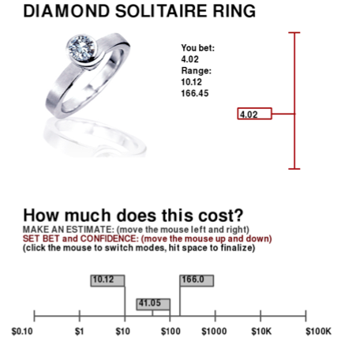

# The Price is Right: Evaluating the role of price knowledge in advertising

# Motivation

In this project, we sought to examine how much people know about the distribution of prices in the world and how their knowledge determines the influence of advertisements. In Experiment 1, we asked participants to guess the prices of real-world product multiple times and also report confidence intervals (if the price was in the range they earned points, but fewer points if the range was larger). Although together participants knew a great deal about the prices of objects (such as their average price and dispersion), individual participants' knowledge was much more impoverished. 

Based on these findings, in Experiment 2 we tested whether participants used the price knowledge they did have to interpret advertisements and infer the prices of new products. Participants performed the same price guessing task but each product was accompanied by an advertisement. Despite possessing limited knowledge about the prices of objects, participant's used their price distribution knowledge alongside advertisements when guessing the prices of objects. That is, the more uncertain people were about the prices of objects, the more they compensated for their uncertainty by relying on the advertisements. 

This is a project I've been working on heavily with my advisor Ed Vul and he's the one responsible for these amazing graphs with ACTUAL images in them and the insane viola plot.

# Experiment 1

## 1 Method

Here is an example of the actual experiment participants performed.



Participants saw an object and guessed its average price (lower horizontal bar) and then set a confidence range (upper vertical bar) and could go back and worth between setting the values until they were satisfied.

## 2 Loading data

First going to quickly load some packages and then format my data.

```{r}
source('utilities.R')
library(jpeg)
```

Here I'm going to load my data and calculate some summary statistics. Unless you're interested in the nuts and bolts, I'd skip to part 3. 

Note, I'm log-transforming people's price estimates.

```{r}
header = c('Subject', 'Block', 'Trial', 'Item.num', 'Item.Name', 'Item.File', 'Modifier.num', 'Modifier.Name', 'Modifier.Direction', 'True.Value', 'Estimate', 'BetValue', 'RangeValue', 'MinValue', 'MaxValue', 'Score', 'RT', 'Timestamp')

files = list.files(path = 'data/value1/')

est.dat = data.frame()
for(f in files){
  dat = read.csv(sprintf('data/value1/%s', f), header=FALSE)
  
  est.dat = rbind(est.dat, cbind(strsplit(f, '_')[[1]][1], dat))
}
names(est.dat) <- header

temp = ddply(est.dat, .(Item.Name, Subject), 
             summarise, 
             Subject.Mean=mean(log10(Estimate), na.rm=T), 
             Subject.sd=sd(log10(Estimate), na.rm=T), 
             Subject.range=mean(RangeValue, na.rm=T))
objects = ddply(temp, .(Item.Name), summarise, 
                Across.S.mean=mean(Subject.Mean, na.rm=T), 
                n.S = sum(!is.na(Subject.Mean)), 
                Across.S.sd=sd(Subject.Mean, na.rm=T), 
                Within.S.sd=mean(Subject.sd,na.rm=T), 
                Within.S.range=mean(Subject.range))
trueProps = ddply(est.dat,~Item.Name,summarise,mean=mean(log10(True.Value)),sd=sd(log10(True.Value)))
objects = cbind(objects, trueProps[,2:3])
```

And I'm going to load images of the objects so that later on I can make some cool figures

```{r}
# read in image files.
im.grobs = list()
for(i in 1:nrow(objects)){
  imname= as.character(objects$Item.Name[i])
  t = gsub("[[:space:]]", ".", imname)
  t = gsub("'", "", t)
  imfile = paste0('imgs/', tolower(t), '.jpeg')
  im.grobs[[imname]] = rasterGrob(readJPEG(imfile), interpolate=TRUE)
}
```

## 3 How much do PEOPLE know about the average price of an object?

First let's look at aggregate performance--Averaging over multiple people, how much does the population know? If we average people's guesses together (y-axis, Across.S.mean), how close are they to the actual prices of objects (x-axis)?

```{r, fig.width=7, fig.height=6}
im.s = 0.05
ggplot(objects, aes(x=mean, y=Across.S.mean)) + 
  mapply(function(xx,yy,name){
    annotation_custom(im.grobs[[name]], 
                      xmin=xx-im.s,
                      ymin=yy-im.s,
                      xmax=xx+im.s,
                      ymax=yy+im.s)},
    objects$mean, objects$Across.S.mean, objects$Item.Name) +
  geom_abline(color="gray",color='brown1')+
  xlab(bquote('Mean'*~log[10]*' price'))+
  ylab(bquote('Mean'*~log[10]*' reported price'))+
  theme_bw() +
  theme(panel.grid = element_blank(), 
        axis.text = element_text(size=18, face='bold'),
        title = element_text(size=26, face='bold'),
        axis.title = element_text(size=22, face='bold'))
```

And we find that the population really has a rather accurate estimate of the mean price of products! The grey line indicates equality and people are pretty close to that.

## 4 How much do people know about the dispersion of objects' prices

In the real-world, people don't need to just know the average price of an object. The price of a shirt can be highly variable like a $5 shirt at H & M compared to a $50 shirt at Urban Outfitters while a basketball is probably going to cost about $20 no matter where you go. How well then do people know the dispersion of products' prices? To evaluate people's price dispersion knowledge, we measured the standard deviation of people's guesses (y-axis, Across.S.sd) for each product and compared it to the actual standard deviation of the product's price (x-axis, sd).

```{r, fig.width=7, fig.height=6}
im.s = 0.015
ggplot(objects, 
       aes(x=sd, y=Across.S.sd)) + 
  mapply(function(xx,yy,name){
    annotation_custom(im.grobs[[name]], 
                      xmin=xx-im.s,
                      ymin=yy-im.s,
                      xmax=xx+im.s,
                      ymax=yy+im.s)},
    objects$sd, objects$Across.S.sd, objects$Item.Name) +
  geom_abline(color='gray')+
  geom_smooth(method="lm",color='brown1')+
  coord_cartesian(ylim=c(0.065, 0.84), xlim=c(0.065, 0.84))+
  xlab(bquote('SD'*~log[10]*' price'))+
  ylab(expression(atop(paste("Across participant SD"),''*~log[10]*' reported price')))+
  theme_bw() +
  theme(panel.grid = element_blank(), 
        axis.text = element_text(size=18, face='bold'),
        title = element_text(size=26, face='bold'),
        axis.title = element_text(size=22, face='bold'))

```

And the population--though not perfect--does a pretty good job at estimating the dispersion of prices. This suggests that the population as a whole generally knows how much the price of an object varies. 

## 5 How much do INDIVIDUALS know about the dispersion of prices?

So people seem to know a good deal about the distribution of prices. But these results reflect the knowledge of **all** of our subjects aggregated together. If we look at the distribution of each **individual** subject's responses, do we see the same kind of accurate knowledge?

### 5.1 As measured by confidence intervals...

First we can look at people's confidence intervals (y-axis, Within.S.range): Do people set confidence intervals that cover about the full-dispersion of the each product's price?

```{r, fig.width=7, fig.height=6}
ggplot(objects, 
       aes(x=sd, y=Within.S.range)) + 
  mapply(function(xx,yy,name){
    annotation_custom(im.grobs[[name]], 
                      xmin=xx-im.s,
                      ymin=yy-im.s,
                      xmax=xx+im.s,
                      ymax=yy+im.s)},
    objects$sd, objects$Within.S.range, objects$Item.Name) +
  geom_abline(color='gray')+
  geom_smooth(method="lm",color="brown1")+
  coord_cartesian(ylim=c(0.065, 0.84), xlim=c(0.065, 0.84))+
  xlab(bquote('SD'*~log[10]*' price'))+
  ylab(expression(atop(paste("Within participant range"),''*~log[10]*' reported price')))+
  theme_bw() +
  theme(panel.grid = element_blank(), 
        axis.text = element_text(size=18, face='bold'),
        title = element_text(size=26, face='bold'),
        axis.title = element_text(size=22, face='bold'))
```

Participants do seem to have some knowledge of how variable objects' prices are. The regression line is positive, indicating that people might know, say, the price of a shirt varies more than the price of a basketball. But people are poorly calibrated to how much objects' prices ACTUALLY vary, as reflected by the regression line being far from equality (the grey diagonal line).

### 5.2 As measured by the dispersion of people's guesses

However, it's possible that people used our confidence scale in a way that didn't reflect their knowledge of products' price distributions. Consequently, tested whether people used their price knowledge when making their individual responses. Similar to our previous analysis (4), we compared the standard deviation of participants' responses to the true standard deviation of each object's price. BUT, whereas before we calculated the standard deviation of all the participants' responses aggregated together, here we focused on individuals and found the standard deviation of each participant's responses for a given object (y-axis, Within.S.sd). This is why it was crucial for us to ask people to make guesses about objects multiple times. 

```{r, fig.width=7, fig.height=6}
ggplot(objects, 
       aes(x=sd, y=Within.S.sd)) + 
  mapply(function(xx,yy,name){
    annotation_custom(im.grobs[[name]], 
                      xmin=xx-im.s,
                      ymin=yy-im.s,
                      xmax=xx+im.s,
                      ymax=yy+im.s)},
    objects$sd, objects$Within.S.sd, objects$Item.Name) +
  geom_abline(color='gray')+
  geom_smooth(method="lm",color='brown1')+
  coord_cartesian(ylim=c(0.065, 0.84), xlim=c(0.065, 0.84))+
  xlab(bquote('SD'*~log[10]*' price'))+
  ylab(expression(atop(paste("Within participant SD"),''*~log[10]*' reported price')))+
  theme_bw() +
  theme(panel.grid = element_blank(), 
        axis.text = element_text(size=18, face='bold'),
        title = element_text(size=26, face='bold'),
        axis.title = element_text(size=22, face='bold'))

```

Similar to confidence intervals, individuals's responses are correlated, but poorly calibrated with the true dispersion of prices. So whereas the population had very accurate knowledge about how prices are distributed, individuals only had a rough sense about what objects had more or less variable prices and really no idea of how much prices varied.

# Experiment 2

We expected that people would use their knowledge of the dispersion of prices to rationally interpret advertisements. More concretely, the more uncertain people are about the price of an object (i.e., the higher the dispersion of an object's price), the more they should rely on advertisements to compensate. Given that individuals seemed to have rather poor knowledge of the dispersion of knowledge, we were unsure whether people would actually account for the distribution of products' prices. Consequently, we had people perform a similar task. Once again, participants made multiple guesses about the prices of different objects. However, this time each product was accompanied by an advertisement (which are laid out in the figure below). We wrote a set of 50 ads half of which were positive and half of which were negative. 

## 1 Do advertisements influence price estimates?

Before we start comparing people's price distribution knowledge to the effects of advertisements, lets see if our advertisements had any effect on people's guesses. We evaluated the effect of each ad by measuring the rank of an object given that ad. The idea behind this measure is that each object was presented multiple times with different ads. For each object then, we can find its percentile rank for a given ad and then average those percentile ranks within ads and across objects. So if all the objects had their highest perceived value when we told the participants the objects were "brand-new", their price percentile would be 1 (top percentile).

```{r}
files = list.files(path = 'data/valuead/')

header = c('Subject', 'Block', 'Trial', 'Item.num', 'Item.Name', 'Item.File', 'Modifier.num', 'Modifier.Name', 'Modifier.Direction', 'True.Value', 'Estimate', 'BetValue', 'RangeValue', 'MinValue', 'MaxValue', 'Score', 'RT', 'Timestamp')
full.dat = data.frame()
for(f in files){
  dat = read.csv(sprintf('data/valuead/%s', f), header=FALSE)
  
  full.dat = rbind(full.dat, cbind(strsplit(f, '_')[[1]][1], dat))
}
names(full.dat) <- header

for(subject in levels(full.dat$Subject)){
  use = full.dat$Subject == subject
  q = subset(full.dat, use)
  full.dat$Range.Norm[use] = (q$RangeValue-mean(q$RangeValue))/max(0.01, sd(q$RangeValue))
}

# For each item, rank its price estimate
for(item in levels(full.dat$Item.Name)){
  use = full.dat$Item.Name == item
  q = subset(full.dat, use)
  full.dat$Est.Item.Rank[use] = (rank(q$Estimate)-1)/(nrow(q)-1)
  full.dat$L10.Relative.Est[use] = log10(q$Estimate) - mean(log10(q$Estimate))
  full.dat$L10.Z.Est[use] = (log10(q$Estimate) - mean(log10(q$Estimate)))/sd(log10(q$Estimate))
}

# And then average over labels to see which labels resulted in higher ranks
modifiers = ddply(full.dat, .(Modifier.Name),summarise, 
                  Rank.mean=mean(Est.Item.Rank), Rank.sd=sd(Est.Item.Rank), 
                  Rel.mean=mean(L10.Relative.Est), Rel.sd=sd(L10.Relative.Est),
                  Abs.mean=mean(log10(Estimate)), Abs.sd=sd(log10(Estimate)),
                  Z.mean=mean(L10.Z.Est), Z.sd=sd(L10.Z.Est),
                  Rank.median = median(Est.Item.Rank), Rank.q25=quantile(Est.Item.Rank, 0.25), Rank.q75=quantile(Est.Item.Rank, 0.75))

# do something to sort these by effectiveness
full.dat$Modifier.Name = factor(full.dat$Modifier.Name, levels(modifiers$Modifier.Name)[order(modifiers$Rank.mean)])

trueProps2 = ddply(full.dat, ~Item.Name,summarise,
                   mean=mean(log10(True.Value)),
                   sd=sd(log10(True.Value)))


m = trueProps2$mean
names(m) = trueProps2$Item.Name
s = trueProps$sd
names(s) = trueProps2$Item.Name

full.dat$True.L10.Mean = m[full.dat$Item.Name]
full.dat$True.L10.SD = s[full.dat$Item.Name]
full.dat$L10.Estimate = log10(full.dat$Estimate)
```

Here we can see the effect of each ad on price estimates. 

```{r, fig.width=12, fig.height=10}
# Sort modifier levels by effectiveness
full.dat$Modifier.Name = factor(full.dat$Modifier.Name, levels(modifiers$Modifier.Name)[order(modifiers$Rank.mean)])
mod.val=ddply(full.dat,c('Modifier.Name'),summarize,valence=mean(Modifier.Direction))
mod.val$Factor.valence=factor(mod.val$valence)
modifiers$Modifier.Name = factor(modifiers$Modifier.Name, levels(modifiers$Modifier.Name)[order(modifiers$Rank.mean)])
full.dat$Factor.Modifier.Direction=factor(full.dat$Modifier.Direction)
modifiers=merge(modifiers,mod.val)


boxfun= function(x){
  m = mean(x)
  s.d = sd(x)
  s.e = sd(x)/sqrt(length(x))
  qs = quantile(x, c(0.1, 0.25, 0.5, 0.75, 0.9))
  vals = c('ymin'=unname(qs['25%']), 
           'lower'=m-s.e,
           'middle'=m, 
           'upper'=m+s.e, 
           'ymax'=unname(qs['75%']))
  
  return(vals)
}

ggplot(full.dat, aes(x=Modifier.Name, y=Est.Item.Rank))+
  geom_violin(fill="gray", color="gray")+
  stat_summary(fun.data = boxfun, geom="boxplot", color="black", size=0.75, fill="indianred1")+
  xlab('') +
  ylab('Within-product price percentile') +
  theme_bw() +
  theme(panel.grid = element_blank(), 
        axis.text = element_text(size=18, face='bold'),
        title = element_text(size=26, face='bold'),
        axis.title = element_text(size=22, face='bold'),
        axis.text.x = element_text(angle=90,hjust=1))
```

There's a lot going on in this plot so let me break it down. On the x-axis we have the our different ads. On the y-axis we have the ads' effect on price estimates. A higher percentile rank indicates higher average ratings. The red viola plots represent histograms, the lines are 25%-75% CI and boxes are 1 SD.

And our ads, despite being somewhat crude, actually affected people's prices estimates! There are a few fun patterns to pick out here. We can see that the opinion of the New Yorker is rated more highly than Consumer Reports. And that people have significant preferences for where their products are made (Italy>Germany>USA>China>Mexico>Malaysia).

## 2 Did people use their price knowledge to interpret ads?

Advertisements can help people infer the value of products when they're uncertain. A rational Bayesian agent, for example, should rely more heavily on ads for products that have more variable prices. That being said, their ability to do so may be impaired by their poor knowledge of price distributions. To test this, we designed a mixed effect model that estimates the influence of each ad for each object and found the absolute difference between the average effect of positive ads and the average effect of the negative ads. If ads were more effective for high price variability objects, then there should be a larger difference between the positive and negative ads for those objects.

```{r, fig.width=7, fig.height=6}
item.mod = lmer(data=full.dat, L10.Estimate~1+True.L10.Mean+(1|Subject)+(1|Item.Name)+(1|Modifier.Name)+(1|Modifier.Name:Item.Name))
item.mod.rf=ranef(item.mod)$'Modifier.Name:Item.Name'
modifiers.rf=(mapply(function(xx){ strsplit(xx,':')[[1]][1]},row.names(item.mod.rf)))
objects.rf=(mapply(function(xx){ strsplit(xx,':')[[1]][2]},row.names(item.mod.rf)))
objmod.rf.df=data.frame('object'=objects.rf,'modifiers'=modifiers.rf,'rf'=item.mod.rf)

objmod.rf.df2=merge(objmod.rf.df,modifiers,by.x='modifiers',by.y='Modifier.Name')
for(i in seq(13,4)){
  objmod.rf.df2[,i]=NULL; 
}

difference.cheap=function(x){
  return(abs(x[1]-x[2]))
}
# For each object, group the positive and negative valence ads
obj.val.shift=ddply(objmod.rf.df2,c('object','Factor.valence'),summarize,mean.shift=mean(X.Intercept.))

# # Find the difference between the positive and negative valence ads for each object
obj.val.dif=ddply(obj.val.shift,c('object'),summarize,val.dif=difference.cheap(mean.shift))

# Figure out whether that difference is correlated with price dispersion
obj.val.dif.disp=merge(objects[,c('Item.Name','sd')],obj.val.dif,by.y='object',by.x='Item.Name')
objects.val=objects
objects.val$val.dif=0

for(i in seq(1,nrow(obj.val.dif.disp))){
  curr.obj=obj.val.dif.disp[i,]$Item.Name
  curr.val=obj.val.dif.disp[i,]$val.dif
  objects.val$val.dif[objects$Item.Name==curr.obj]=curr.val
}

im.s=.02
ggplot(objects.val, 
       aes(x=sd, y=val.dif)) + 
  mapply(function(xx,yy,name){
    annotation_custom(im.grobs[[name]], 
                      xmin=xx-im.s,
                      ymin=yy-im.s,
                      xmax=xx+im.s,
                      ymax=yy+im.s)},
    objects.val$sd, objects.val$val.dif, objects.val$Item.Name) +
  geom_smooth(method="lm",color="brown1")+
  xlab(bquote('SD'*~log[10]*' price'))+
  ylab('Positive-Negative ad difference')+
  theme_bw() +
  theme(panel.grid = element_blank(), 
        axis.text = element_text(size=18, face='bold'),
        title = element_text(size=26, face='bold'),
        axis.title = element_text(size=22, face='bold'))
```

And that's what we find! Note, this a small effect (the difference in magnitude is quite small), but a significant one, which jives with our finding that people's distribution knowledge is poorly calibrated.

For example, compared to the variance accounted for by the ads themselves

```{r}
ads.magnitude=mean(abs(ranef(item.mod)$'Modifier.Name')[[1]])
ads.disp.magnitude=mean(abs(ranef(item.mod)$'Modifier.Name:Item.Name')[[1]])

ads.disp.magnitude/(ads.magnitude+ads.disp.magnitude)

```


# 8 Conclusions

Even though individuals possess deficient knowledge of price distributions, they use that knowledge to some extent to interpret advertisements. There's a few immediate questions that these results raise:

1. How good is price distribution knowledge?-Individuals DID possess pretty good knowledge of the relative dispersion of prices, despite not having accurate knowledge of the absolute dispersion. There may be ways of eliciting or teaching more accurate responses
2. What ads are effective?-We designed a good number of simple ads that varied in their effectiveness. By precisely manipulating the products or ads people see, we may be able to determine what advertisements will have the greatest effect on consumers. For example, ads may have the most influence when they inform dimensions that people are very uncertain about (e.g., the durability of a table) 

